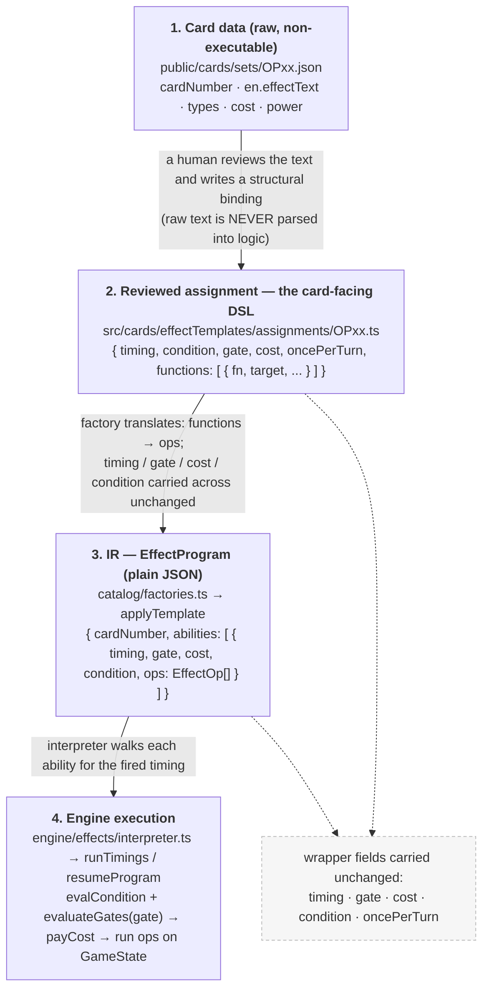

# Effect Template Abstraction Guide

This project treats card effects as reviewed data that composes reusable engine capabilities.
Do not parse API text into executable logic, and do not add a new function name just because a
card phrases an existing effect differently.

## Mental Model

Every card ability should be modeled as:

1. Timing: when the ability can exist or fire.
2. Wrapper rules: cost, once-per-turn, condition, and gate.
3. Ordered functions: one or more reusable effect functions, such as `ko`, `rest`, `addPower`, `addCost`, `addKeyword`, `moveCards`, `searchTopDeck`, or `draw`.
4. Function parameters: target/source/destination/filter/count/duration/reveal/etc. These are data, not new function names.
5. Sequence gates: `ifPrevious` or `ifGate` when later functions depend on prior results.

The function name should describe the engine capability. The parameters should describe who it
affects, where cards move from/to, how many cards are involved, and what filters apply.

```ts
{
  timing: 'activateMain',
  cost: [{ kind: 'donMinus', count: 1 }],
  functions: [
    { fn: 'addCost', target: { group: 'characters', player: 'opponent' }, amount: -2, optional: true },
    { fn: 'ko', target: { group: 'characters', player: 'opponent', filter: { maxCost: 0 } }, optional: true }
  ]
}
```

Do not encode timing, target, source, destination, filter, or card names into the function name.
For example, prefer `fn: 'ko'` plus `target: ...` over `koOpponentCharacter`, and prefer
`fn: 'moveCards'` plus `from`/`to` over `returnToHand`.

Before adding engine or catalog code, ask:

> Is this a new engine capability, or only another composition of existing capabilities?

If it is only another composition, reuse the existing catalog function and change parameters.

## Card-Facing Templates vs Engine IR

The catalog in `src/cards/effectTemplates/catalog` is the card-facing language. Assignments should
use semantic functions such as `searchTopDeck`, `moveCards`, `draw`, `playFromHand`, or `addDonFromDeck`.

The engine IR in `src/engine/effects` may keep lower-level operations such as `chooseTargets`,
`moveToHand`, `moveToBottomDeck`, `ko`, or `addPower`. Those are VM operations, not card assignment
APIs. Card assignments should not reach for phrase-shaped wrappers when a generic catalog function
exists.

The legacy `src/cards/effectParser` directory is not the contribution path for reviewed card logic.
It may still contain old hint names used for analysis, but curated assignments must be structural
and reviewed.

## Movement

Use `moveCards` for card movement. Do not add helpers like `returnToHand`,
`moveFromTrashToHand`, `moveDeckTopToLife`, `moveHandToLife`, or `trashOpponentLife`.

`moveCards` has two explicit halves:

```ts
{
  fn: 'moveCards',
  from: { zone: 'characters', player: 'opponent', filter: { maxCost: 5 } },
  to: { zone: 'hand', player: 'owner' },
  optional: true
}
```

Common shapes:

```ts
// Return up to 1 Character with cost 5 or less to its owner's hand.
{ fn: 'moveCards', from: { zone: 'characters', player: 'any', filter: { maxCost: 5 } }, to: { zone: 'hand', player: 'owner' }, optional: true }

// Place up to 1 opponent Character with 3000 power or less at the bottom of its owner's deck.
{ fn: 'moveCards', from: { zone: 'characters', player: 'opponent', filter: { maxPower: 3000 } }, to: { zone: 'deck', player: 'owner', position: 'bottom' }, optional: true }

// Add the top or bottom card of your Life to hand without revealing card identities.
{ fn: 'moveCards', from: { zone: 'life', player: 'controller', position: 'topOrBottom', hiddenChoice: true }, to: { zone: 'hand', player: 'owner' }, optional: true }

// Move the top card of your deck to the top of your Life.
{ fn: 'moveCards', from: { zone: 'deck', player: 'controller', position: 'top' }, to: { zone: 'life', player: 'controller', position: 'top' } }

// Put one of your cost-3 Characters on top of Life face-up.
{ fn: 'moveCards', from: { zone: 'characters', player: 'controller', filter: { exactCost: 3 } }, to: { zone: 'life', player: 'owner', position: 'top', faceUp: true }, optional: true }

// Add a matching card from trash to hand.
{ fn: 'moveCards', from: { zone: 'trash', player: 'controller', filter: { category: 'character', maxCost: 2 } }, to: { zone: 'hand', player: 'owner' }, optional: true }
```

Life privacy matters. Effects that say top or bottom Life should present the player with top/bottom
options, not revealed card identities, unless the card text explicitly says to look at or reveal the
Life card.

## Search

Use `searchTopDeck` for all "look at N cards" search effects. The parameters decide:

- `look`: how many cards are inspected.
- `pick`: how many cards may be selected.
- `reveal`: whether the selected card is public.
- `destination`: where selected cards go.
- `remainder`: where unselected cards go, such as bottom of deck or trash.
- `filter`: the semantic filter for selectable cards.

Do not create one function per search family. For example, a searcher that adds to hand and a searcher
that puts the chosen card on Life are the same search capability with different `destination`.

## Costs, Gates, and Sequence

Costs belong in the ability wrapper:

```ts
{
  timing: 'activateMain',
  cost: [{ kind: 'donMinus', count: 1 }, { kind: 'restThis' }],
  functions: [{ fn: 'draw', amount: 1 }]
}
```

Use `ifPrevious: 'previousMovedAny'` for "if you do" or "then, if a card was actually moved" logic.
Use `ifGate` when a later function has a condition that is checked after earlier functions resolve.

```ts
functions: [
  { fn: 'moveCards', from: { zone: 'life', player: 'controller', position: 'topOrBottom', hiddenChoice: true }, to: { zone: 'hand', player: 'owner' }, optional: true },
  { fn: 'playFromHand', filter: { maxCost: 4 }, ifPrevious: 'previousMovedAny' }
]
```

`chooseOne` branch options should use semantic labels, not copied card text. Today, branch operations
must be non-suspending; if a branch needs a nested target choice, add that as a deliberate engine
extension instead of forcing it into the current branch model.

## Targeting

Use `TargetSpec` for effects that apply to cards in play. Do not add helpers like
`koOpponentCharacter`, `modifyCostOpponent`, `addPowerController`, `addKeywordSelf`, or
`koBattleOpponent`. Those are all compositions of a generic function plus a target.

Targets describe who or what an effect can apply to:

```ts
type TargetSpec =
  | { ref: 'self' }
  | { ref: 'previous' }
  | { ref: 'battleOpponent' }
  | { group: 'leader'; player: 'controller' }
  | { group: 'characters'; player: 'controller' | 'opponent' | 'any'; filter?: TargetFilter }
  | { group: 'leaderOrCharacters'; player: 'controller' | 'opponent'; filter?: TargetFilter };
```

Common target shapes:

```ts
// This card.
{ ref: 'self' }

// The target selected by the immediately previous function.
{ ref: 'previous' }

// The opponent Character this source battled with.
{ ref: 'battleOpponent' }

// Your Leader.
{ group: 'leader', player: 'controller' }

// Up to 1 opponent Character with cost 4 or less.
{ group: 'characters', player: 'opponent', filter: { maxCost: 4 } }

// Any Character, either player's, with 3000 power or less.
{ group: 'characters', player: 'any', filter: { maxPower: 3000 } }

// Your Leader or Characters, optionally filtered by type/name.
{ group: 'leaderOrCharacters', player: 'controller', filter: { typeIncludes: 'Straw Hat Crew' } }

// Your opponent's Leader or Characters.
{ group: 'leaderOrCharacters', player: 'opponent' }
```

### CURRENT vs BASE cost/power filters (important)

A `TargetFilter` on cards **in play** exposes two distinct families of cost/power filters. Choosing the
wrong one silently mis-resolves the card, so match the card's exact wording:

| Card text | Filter to use | Reads |
| --- | --- | --- |
| "…with a cost of N or less" / "…with N power or less" | `maxCost` / `maxPower` | **CURRENT** value — includes continuous buffs/debuffs and the on-turn +1000/DON!! bonus (`computeCurrentCost`/`computeCurrentPower`). |
| "…with a **base** cost of N…" / "…with N **base** power…" | `maxBaseCost` / `minBaseCost` / `exactBaseCost` / `maxBasePower` / `minBasePower` / `exactBasePower` | **BASE** (printed) value — the card's original cost/power, ignoring all modifiers (`def.baseCost` / `def.basePower`). |

```ts
// "K.O. up to 1 of your opponent's Characters with 6000 power or less"  → CURRENT
{ group: 'characters', player: 'opponent', filter: { maxPower: 6000 } }

// "K.O. up to 1 of your opponent's Characters with 6000 BASE power or less"  → BASE
{ group: 'characters', player: 'opponent', filter: { maxBasePower: 6000 } }

// "All of your Characters with a BASE cost of 1 …"  → BASE
{ group: 'characters', player: 'controller', filter: { exactBaseCost: 1 } }
```

Why it matters: a Character printed at 5000 power but buffed to 7000 **passes** `maxBasePower: 5000`
(base is still 5000) yet **fails** `maxPower: 5000` (current is 7000). ~123 cards (77 "base power",
46 "base cost") require the base variants; using `maxPower`/`maxCost` for them is a bug.

Note: for **off-field** search targets (hand / deck / trash via `SearchFilter`), `maxCost`/`maxPower`
already read the base/printed value — a card not in play has no modifiers, so base ≡ current there.

## Targeted Effects

Use generic targeted functions:

```ts
// K.O. up to 1 opponent Character with 5000 power or less.
{ fn: 'ko', target: { group: 'characters', player: 'opponent', filter: { maxPower: 5000 } }, optional: true }

// Rest up to 2 opponent Characters with cost 2 or less.
{ fn: 'rest', target: { group: 'characters', player: 'opponent', filter: { maxCost: 2 } }, optional: true, maxTargets: 2 }

// Give up to 1 opponent Character -2000 power during this turn.
{ fn: 'addPower', target: { group: 'characters', player: 'opponent' }, amount: -2000, duration: 'duringThisTurn', optional: true }

// Give up to 1 opponent Character -4 cost during this turn.
{ fn: 'addCost', target: { group: 'characters', player: 'opponent' }, amount: -4, optional: true }

// Give up to 1 of your Leader/Characters +4000 during this battle.
{ fn: 'addPower', target: { group: 'leaderOrCharacters', player: 'controller' }, amount: 4000, duration: 'duringThisBattle', optional: true }

// This card gains Rush while it has enough DON!! attached.
{ fn: 'addKeyword', target: { ref: 'self' }, keyword: 'rush', duration: 'permanent', condition: { donAttachedAtLeast: 2 } }
```

Do not add a new target/effect function when a parameter is enough. Prefer extending `TargetFilter`,
`TargetSpec`, or the existing generic function. Add a new function only when the effect itself is a
new game capability, not because the target changed.

Effects that apply to every matching card without a target choice are different semantics. Keep or
add explicit all-board/aura functions for those cases, such as `koAllCharacters` or
`addPowerAuraControllerTypes`, because they are not "choose up to N targets" effects.

## Naming Rules

Good names describe engine semantics:

- `moveCards`
- `searchTopDeck`
- `ko`
- `rest`
- `addPower`
- `addCost`
- `addKeyword`
- `playFromHand`
- `triggerPlaySelf`
- `addDonFromDeck`

Avoid names that describe one card sentence:

- `moveHandToLifeTop`
- `koOpponentCharacter`
- `modifyPowerOpponentLeaderOrCharacter`
- `addPowerControllerCharacter`
- `addKeywordSelf`
- `returnCostFiveCharacter`
- `opponentChooseTrashLifeOrAddDeckTopToLife`
- `whenAttackingSearchTopDeck`

If a name contains a timing plus an effect, split timing into `params.timing` and keep the function
timing-free.

## Adding New Coverage

For each set or semantic family:

1. Read all relevant card text.
2. Group cards by effect structure, not by card number.
3. Check whether existing functions and filters can express the group.
4. Add only the smallest missing primitive/template.
5. Implement all cards in the family using structural params.
6. Add generic tests for the semantic capability.
7. Update `docs/coverage/effect-coverage.csv`.

Tests should prove engine behavior or catalog translation for the family. Avoid set-specific tests
unless a card uncovers a unique rules interaction.

## Raw Text Boundary

Assignment params must not contain copied effect prose. Raw text belongs in card data. Reviewed
assignment params are structural only.

Use semantic labels for UI/options:

```ts
{ label: 'trashOpponentLifeTop', functions: [...] }
{ label: 'moveControllerDeckTopToLifeTop', functions: [...] }
```

Do not use labels like "Your opponent trashes 1 Life card" in assignment params.

## Pipeline: from card data to engine execution

This section is for new contributors. A card effect flows through **four layers**. The important
thing to internalise: `gate` (and `cost`, `condition`, `timing`) are **wrapper fields that ride
along the whole way** — they are *not* stages in the pipeline. The only real transformation is
`functions → ops`.



ASCII fallback (same thing):

```
 raw card data ──(a reviewer writes)──▶ assignment params { timing, gate, cost, functions }
                                               │  factories.ts: functions ─▶ ops
                                               ▼
                                     IR ability { timing, gate, cost, ops }
                                               │  interpreter.ts runs it
                                               ▼
   engine: evalCondition + evaluateGates(gate) ─▶ payCost ─▶ execute ops on GameState
```

### Where each field is defined vs. evaluated

| Concern | Declared in (layer 2, assignment) | Type lives in | Evaluated / executed in (layer 4) |
| --- | --- | --- | --- |
| `timing` | `params.timing` | `IrTiming` (effectIr.ts) | which fire hook calls `runTimings` (fireTiming.ts) |
| `condition` (`[DON!! xN]`, `[Your Turn]`) | `params.condition` | `IrCondition` | `evalCondition` (interpreter.ts) |
| `gate` (`If <board state>…`) | `params.gate` | `AbilityGate` (effectIr.ts) | `evaluateGates` (gates.ts) |
| `cost` (`DON!! −N`, rest this, …) | `params.cost` | `AbilityCost` (effectIr.ts) | `canPayAbilityCost` / `payAbilityCost` (abilityCost.ts) |
| the actual effect | `params.functions` | `AbilityFunction` (templateDefs.ts) | becomes `EffectOp[]`, run by the interpreter |

### Worked example — OP06-075

Card text: `[On Play] DON!! −1: Rest up to 2 of your opponent's Characters with a cost of 2 or less.`

**Layer 2 — assignment** (`assignments/OP06.ts`): timing + a `cost` wrapper + one function.

```ts
{ cardNumber: 'OP06-075', templateId: 'ability', params: {
  timing: 'onPlay',
  cost: [{ kind: 'donMinus', count: 1 }],
  functions: [
    { fn: 'rest', target: { group: 'characters', player: 'opponent', filter: { maxCost: 2 } }, optional: true, maxTargets: 2 },
  ],
} }
```

**Layer 3 — IR** (produced by `applyTemplate`): the `rest` function expanded into two ops; the
`cost` and `timing` carried straight across.

```jsonc
{ "cardNumber": "OP06-075", "abilities": [ {
  "timing": "onPlay",
  "cost": [{ "kind": "donMinus", "count": 1 }],
  "ops": [
    { "op": "chooseTargets", "var": "t", "from": { "sel": "opponentCharacters", "maxCost": 2 }, "min": 0, "max": 2 },
    { "op": "rest", "target": { "sel": "var", "name": "t" } }
  ]
} ] }
```

**Layer 4 — engine**: `fireOnPlay` → `runTimings(program, ['onPlay'], …)` → checks condition/gate
(none here) → pays the DON!! −1 cost → runs `chooseTargets` (suspends for player input) →
`resumeProgram` binds the selection → runs `rest`.

### A gated example — OP09-066

Card text: `[On Play] If your opponent has more DON!! cards than you, K.O. up to 1 of your opponent's Characters with a cost of 3 or less.`

Only difference from the shape above: the `[If …]` clause becomes a **`gate`** on the wrapper, and
there is no `cost`.

```ts
{ cardNumber: 'OP09-066', templateId: 'ability', params: {
  timing: 'onPlay',
  gate: [{ kind: 'opponentDonMoreThanSelf' }],
  functions: [ { fn: 'ko', target: { group: 'characters', player: 'opponent', filter: { maxCost: 3 } }, optional: true } ],
} }
```

At layer 4, `runTimings` calls `evaluateGates([{ kind: 'opponentDonMoreThanSelf' }], …)` *before*
running the ops; if it returns false the whole ability is skipped.

### Adding a new capability — which file changes

- **New gate** (a new `If <board state>` precondition): add the variant to `AbilityGate` in
  `engine/effects/effectIr.ts`, then a `case` in `engine/effects/gates.ts`. Two files, no factory
  change — it's just data flowing through. (This is exactly how `selfDonAtMostOpponent` and
  `selfRestedCharacterCount` were added; see their `__tests__`.)
- **New cost**: add to `AbilityCost` (effectIr.ts) + handle it in `engine/effects/abilityCost.ts`.
- **New effect verb**: add to `AbilityFunction` (`catalog/templateDefs.ts`) and its `functions → ops`
  translation in `catalog/factories.ts`; if it needs a genuinely new runtime operation, also add the
  `EffectOp` to `effectIr.ts` and implement it in `engine/effects/interpreter.ts`.
- **New timing**: add to `IrTiming` (effectIr.ts) and wire a fire hook in `engine/effects/fireTiming.ts`.

Prefer, in order: a new **parameter** on an existing function → a new **gate/cost** (data only) →
a new **function that composes existing ops** → a brand-new **`EffectOp`** (real engine capability).
Only reach for the last when the effect is a new game action, not a new phrasing of an old one.
